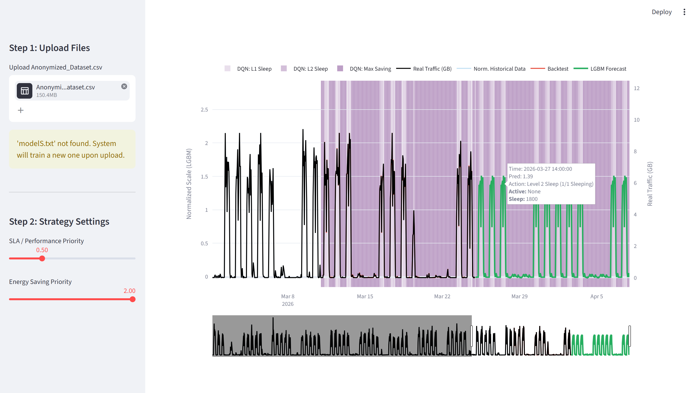
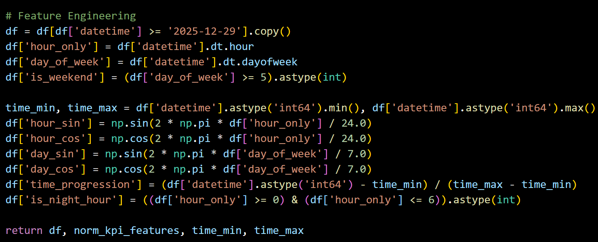

# Network Traffic AI Decision Support System
An end-to-end machine learning pipeline and interactive decision support dashboard designed for telecommunications network capacity planning and autonomous cell sleep-mode optimization.

.png)
# Executive Summary
Managing telecommunications network traffic requires balancing strict **Service Level Agreements (SLAs)** with **energy efficiency**. 

This system ingests hourly traffic telemetry, applies robust mathematical scaling, forecasts future demand across a rolling horizon using **LightGBM**, and leverages an autonomous **Deep Q-Network (DQN)** decision-making engine to trigger carrier sleep/wake actions dynamically.

# Key Features
* **Automated Data Processing:** Preprocesses sector-level telemetry by filtering noise and outliers using IQR-based scaling.
* **Cyclical Feature Engineering:** Incorporates periodic time dynamics using sine/cosine transformations for hours and days of the week.
* **LightGBM Forecasting Engine:** Predicts multi-step network traffic patterns dynamically.
* **Autonomous DQN Sleep-Mode Logic:** Evaluates predicted load against configurable SLA vs. Energy Saving priorities to determine optimal power states (Active, Level 1 Sleep, Level 2 Sleep, Max Saving).
* **Interactive Visualization:** Built with Streamlit and Plotly for deep exploratory drill-downs and auditability.
# Feature Engineering & Analytics
To model periodicity effectively without treating time as linear integers, cyclical temporal transformations and rolling progression features are constructed:

# Interactive Analytical Report
The repository includes an interactive offline HTML report generated via Plotly for testing and auditing:
* View report: [`Network_Report_VZHLE-1 (13).html`](Network_Report_VZHLE-1%20(13).html)

# Tech Stack
* **Language:** Python
* **Machine Learning & RL:** LightGBM, Deep Q-Networks (DQN), Scikit-Learn
* **Data Processing:** Pandas, NumPy
* **Visualization & Dashboard:** Streamlit, Plotly
